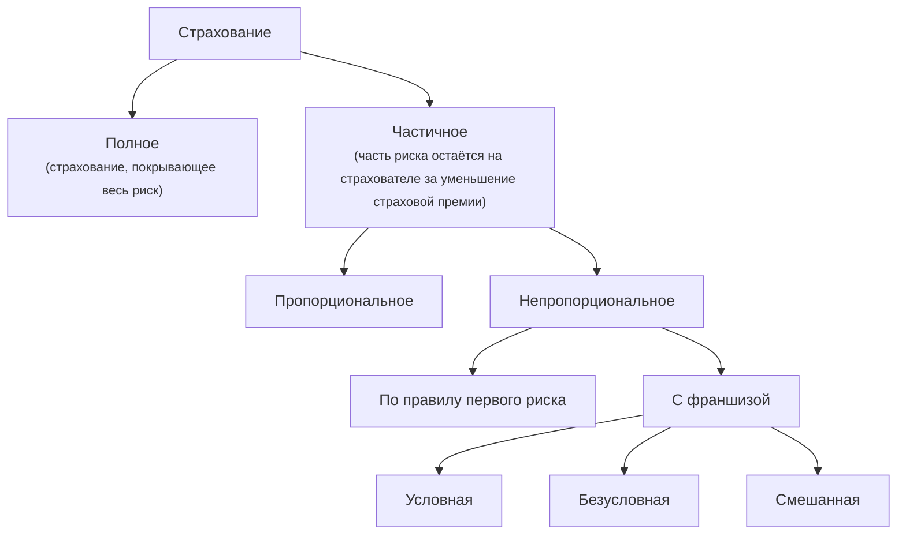

# Основы страхования и актуарных расчётов

<!--
1 сентября 2025 · лекция
 -->

Лекция

::: tip План лекции
* История страхования и основные понятия
* История актуарных расчётов и задачи актуариев
* Основные принципы страхования
* Классификация отраслей страхования
* Методы распределения ответственности за риск
:::

## История страхования

### Основные этапы

1. Древний мир — зарождение некоммерческого страхования
2. Средние века — становление некоммерческого страхования
3. Раннее коммерческое страхование
4. Развитие коммерческого страхования — появление страхования жизни
5. Современное страхование

### Этап I

* 6 тыс. лет назад — самые древние правила страхования, дошедшие до нас, изложены в одной из книг Талмуда: «Если у одного из погонщиков ослов гибло животное, Талмуд предписывал остальным погонщикам выделить ему взамен другого осла, но только не деньги».

* 5-6 тыс. лет назад в Шумере: торговцам выдавалась финансовая гарантия для защиты своих интересов в случае утраты груза во время перевозки.

* 4 тыс. лет назад в Вавилоне: в законах вавилонского царя Хамурапи устанавливалось взаимное страхование караванов вавилонских путешественников от вреда, причиняемого им нападениями разбойников.

* В Египте и древнем Риме существовали религиозные товарищества, целью которых было оказывать помощь родственникам своих умерших членов.

### Этап II

* 10 век — англосаксонская гильдия учредила особую кассу для возмещения своим участникам стоимости украденного скота.

* 11 век — в Дании образовывались союзы, выдававшие своим членам возмещение, если кто-то попадал в плен или терпел кораблекрушение.

* 12 век — в Исландии крестьяне образовывали союзы для совместного несения убытков от пожаров и падежа скота.

* 15 век — в Португалии образуются товарищества мореплавателей, возмещавшие убытки от морских опасностей.

В эпоху средневековья некоммерческий тип страхования существовал и на Руси. Так община должна была выплатить возмещение, если на её теорритории происходило убийство и убийца не был пойман.

Некоммерческое страхование основано на **принципе взаимности**.

### Этап III

* 12 век — на Средиземном море возникают морские займы, представляющие собой нечто среднее между обыкновенным займом и товариществом.

* 14 век — в Италии возникает самостоятельный договор морского страхования — полис. Морское страхование проникает в другие страны Европы — Англию, Голландию и Испанию.

* 17 век — громадный пожар в Лондоне (1666 г.) приводит к возникновению страхования от огня. В дальнейшем появляются страхования от града, падежа скота, сухопутное транспортное и другие виды имущественного страхования.

### Этап IV

* В 1762 г. в Англии появилась страховая компания «Общество справедливого страхования жизни». В 1765 г. эта компания была официально зарегистрирована. Это общество считается старейшим в мире и занимается страхованием жизни и по сей день.

* В 19 веке страхование жизни появляется в Америке, большинстве стран Европы, Японии и др.

В России некоммерческое страхование завершилось в 17 веке, а коммерческое формально началось в 18 веке, а реально в 19 веке. Несмотря на это, к 1917 г. развитие коммерческого страхования привело к созданию достаточно зрелого страхового рынка, интегрированного в международное рыночное хозяйство.

### Этап V

Современное страхование продолжает активно развиваться. Ежегодно появляются новые виды страхования.

После появления и развития интернет-технологий возникло онлайн-страхование, которое позволило:

* упростить процесс страхования;
* сократить время на оформление;
* минимизировать «человеческий» фактор.

До мирового финансового кризиса в 2008 г. ежегодный прирост объёма страховых премий в РФ составлял 15-30% в год. Кризис отрицательно отразился на состоянии страхового рынка в РФ, тем не менее, тенденция в его развитии положительна.

## Основные понятия страхования

**Страхователь** — юридическое лицо или дееспособное физическое лицо, заключившее со страховщиком договор страхования либо являющееся страхователем в силу закона ¹.

**Страховщик** — юридическое лицо, созданное для оказания страховых услуг и действующее на основании лицензии Федеральной службы по надзору за страховой деятельностью.

Страховщик за плату **(страховая премия)** обеспечивает страхователю страховую защиту. Отношения между страхователем и страховщиком оформляются **страховым договором**.

¹ Это ситуации, когда государство обязывает конкретную категорию лиц или организаций страховать определённые риски. В этих случаях страхователь не выбирает, страховаться ему или нет — он обязан это сделать. Например, **ОСАГО (Обязательное страхование автогражданской ответственности)** — вы не можете легально управлять автомобилем без полиса ОСАГО (ФЗ №40).

**Страховая сумма ($\boldsymbol{S}$)** — максимально возможный объём ответственности страховщика.

**Страховая стоимость ($\boldsymbol{C}$)** — оценка стоимости объекта страхования ($S \le C$).

**Сумма ущерба** — денежный эквивалент потерь страхователя в результате наступления страхового случая.

* *фиксированный* — страховой случай наступает с вероятностью $p$ и страховая сумма выплачивается полностью.
* *распределённый* — ущерб является случайной величиной, размер ущерба может быть любым от $0$ до $C$.

**Сумма возмещения ($\boldsymbol{Y}$)** — сумма, выплачиваемая страхователю при наступлении страхового случая согласно условиям договора страхования.

$$
Y \le \min (X, S)
$$

::: info Пример
Вы — владелец автомобиля и виновник ДТП (ваша ответственность застрахована по ОСАГО).

* По закону об ОСАГО лимит выплаты за ущерб имуществу составляет 400 000 руб. Это и есть **страховая сумма $\boldsymbol{S}$**.

* Предположим, рыночная стоимость пострадавшей машины на момент ДТП составляет 800 000 руб. Это и есть **страховая стоимость $\boldsymbol{C}$**.

* Эксперт осмотрел машину и посчитал, что на ремонт бампера, фары и крыла нужно 120 000 руб. Это и есть **сумма ущерба $\boldsymbol{X}$**.

* В данном случае ущерб меньше лимита, поэтому страховая выплатит всю сумму ущерба. **Сумма возмещения $\boldsymbol{Y}$** = 120 000 руб.

Если бы **сумма ущерба $\boldsymbol{X}$** была бы больше **страховой суммы $\boldsymbol{S}$**, например, $X$ = 500 000 руб., то **сумма возмещения $\boldsymbol{Y}$** страховой компании = 400 000 руб. (по лимиту). Оставшиеся 100 000 руб. пострадавший может попытаться взыскать с вас, виновника ДТП, уже в судебном порядке.
:::

**Страховой риск** — предполагаемое событие, на случай наступления которого проводится страхование.

**Страховой случай** — случайное событие, реализовавшийся страховой риск, при наступлении которого в силу договора или закона страховщик обязан осуществить страховую компенсацию.

::: info Пример
**Страховой риск** — возможность пожара. Это то, что может случиться, но ещё не случилось. Вы платите страховку именно за защиту от этой опасности.

**Страховой случай** — квартира загорелась, и ей нанесён ущерб. Это то, что произошло на самом деле. Теперь вы можете требовать выплату.
:::

**Риск** — это угроза (причина), **случай** — это событие (следствие).

**Страховая ответственность** — обязанность страховщика выплатить страховое возмещение на условиях, оговоренных в договоре страхования или законом.

**Срок страхования** — период действия договора страхования.

**Страховой портфель** — фактическое количество застрахованных объектов.

**Убыточность страховой суммы** — экономический показатель результатов деятельности страховщика, представляющий собой отношение объёма страховых выплат к общей сумме страховых премий.

<b>Убыточность страховой суммы</b> =

<b>сумма страховых выплат</b>

<b>сумма страховых премий</b>

· 100%.

* УСС < 100% — нормальная ситуация. У компании есть деньги на расходы и прибыль. Для ОСАГО 80-90%, КАСКО 60-70%, страхование имущества (квартиры, дома) 30-50%.

* УСС > 100% — кризисная ситуация. Страховая компания работает в убыток и рискует разориться.

## История актуарных расчётов. Понятие актуария и его задачи

### Этапы

Выделяют 4 этапа развития актуарных расчётов:

1. Появление актуариев страхования жизни
2. Появление актуариев страхования не-жизни
3. Соединение актуарной математики с финансовой экономикой
4. Внедрение в актуарную математику риск-менеджмента

### Этап I

* В 1662 г. была опубликована работа английского учёного Джона Граунта², в которой впервые были представлены результаты обработки данных о смертности людей и таблицы смертности (ТС).

* Примерно в это же время голландский учёный Ян де Витт исследовал вопросы зависимости стоимости договоров страхования жизни от смертности людей. Им были исследованы методы вычисления страховых взносов в зависимости от возраста застрахованного.

* В 1693 г. английский учёный Эдмунд Галлей построил первую достаточо полную ТС, дал определение основных функций ТС, ввёл понятие средней продолжительности предстоящей жизни и рассчитал тарифы по страхованию жизни при помощи ТС. На разработанную им методику опираются современные приёмы расчёта тарифов по страхованию жизни и пенсии.

* В 1762 г. в Лондоне возникла первая страховая компания с актуариями — «Общество справедливого страхования жизни». Главное должностное лицо этого Общества именовалось актуарием. Изначально функция актуария заключалась в регистрации контрактов, заключённых обществом. В 1775 г. этот пост занял математик Вильям Морган. Он расширил методы вычисления приемлемых ставок страховых взносов, после чего актуарии стали выполнять финансовую и математическую работу.

* В 1848 г. появился Институт актуариев в Лондоне, а в 1856 г. факультет актуариев в Эдинбурге.

* В 1889 г. актуарное общество было создано в Америке. С 1897 г. оно стало проводить обучение и аттестацию актуариев.

* В 1895 г. национальные профессиональные общества Бельгии, Франции, Германии, Великобритании и США организовали «Международную Актуарную Ассоциацию» (International Actuarial Association, IAA), базирующуюся в Брюсселе, которая начала проводить регулярные конгрессы актуариев, продолжалющиеся и по сей день.

² Д. Граунт «Естественные и политические наблюдения, сделанные над бюллетенями смертности», 1662 г.

### Этап II

Актуарные расчёты страхования не-жизни имеют существенно более сложный математико-статистический аппарат. На этом этапе актуарии начинают предсказывать убытки с помощью вероятностных моделей.

* Началом послужила работа шведсого актуария и математика Филиппа Лундберга³, в которой были заложены основы коллективной теории риска и высказаны первые идеи использования стохастических уравнений.

* Идеи Лундберга получили развитие только в 1930-1940 гг. благодаря работам отечественных математиков — П.Л. Чебышева, А.А. Маркова, А.Н. Колмогорова, А.М. Ляпунова, С.Н. Бернштейна, А.Я. Хинчина и др.

³ Ф. Лундберг «Аппроксимация функции вероятности / Перестрахование коллективных рисков», 1903 г.

### Этап III

В 1980-1990 гг. актуарная математика, как в страховании жизни, так и в страховании не-жизни, характеризуется активным использованием финансовых инструментов, включая производные финансовые инструменты, такие как форварды, фьючерсы, опционы и другие.

Для третьего этапа характерно использование более продвинутых математических и статистических методов — стохастического исчисления, стохастических дифференциальных уравнений, новых статистических методов, современной компьютерной техники и программного обеспечения.

### Этап IV

Актуарные расчёты становятся ещё более сложной и многократной сферой науки, сочетающей в себе сложнейшие современные методы и достижения, круг задач которой постоянно расширяется.

Одна из последних и самых актуальных задач — создание системы управления рисками компании (риск-менеджмент, Enterprice Risk Management).

Управление рисками компании — это единая систематическая оцнка и контроль всех рисков, возникающих в работе страховой организации, их взаимосвязей и взаимозависимостей. В этом случае анализируются не только страховые риски, но финансовые, операционные и стратегические.

### История актуарных расчётов в России

В России в конце 19 века профессия актуария была весьма востребована. Самым известным российским актуарием является С.Е. Савин. Он являлся вице-президентом 1-го и 2-го Международного конгресса актуариев.

После революции 1917 г. потребность в актуариях отпала. Возрождение профессии актуария связано с ликвидацией монополии государства в 1988 г. В это время происходит массовое полявление страховых компаний, ранее не связанных со страхованием, многие из которых не имели актуариев.

Второй этап возрождения профессии актуария — 1994 г., когда было учреждено «Общество актуариев», и в МГУ состоялся первый съезд актуариев России. Первым президентом Общества был А.Н. Ширяев.

### Понятие актуария и его основные задачи

**Актуарные расчёты (actuarial science)** — это совокупность математических, статистических, экономических, финансовых и демографических методов, используемых при оценке финансовых взаимоотношений сторон в различных видах финансовой деятельности, а прежде всего в страховании.

**Актуарий** — специалист по страховой математике, владеющий теорией актуарных расчётов и обладающий знаниями соответствующего уровня математики, экономики и финансов.

**Основные задачи актуария:**

* оценка и управление рисками;
* оценка вероятности наступления страховых случаев;
* определение убыточности страхового портфеля;
* определение распределения ущерба в случае наступления страхового случая;
* расчёт тарифных ставок по каждому виду страхования;
* и т.д.

## Основные принципы страхования

1. **Принцип случайности.** Страховаться могут только те риски, которые обладают признаком случайности и вероятности их наступления.

   Все риски можно разделить на две группы:

   * *чистые риски* — связаны со случайными событиями, которые влекут за собой только ущерб или оставляют ситуацию неизменной;
   * *спекулятивные риски* — предполагают возможность как убытков, так и извлечения прибыли. Пример: торговля на фондовом рынке. Приобретая акции определённой компании, инвестор может как понести потери, так и получить прибыль.

   Таким образом, страховаться могут только *чистые риски*, поскольку спекулятивные риски не являются случайными (например, инвестор при покупке акций несёт осознанные риски).

   Этот принцип защищает страховую компанию от мошенничества и финансового краха. Если бы можно было страховать предопределённые события, каждый бы страховывал неизбежные убытки и компания мгновенно разорилась.

2. **Принцип солидарной и замкнутой раскладки ущерба.** Данный принцип означает, что страхование основано на предпосылке о том, что количество страхователей, для которых реализовался страховой риск, существенно меньше общего числа застрахованных.

   *Принип солидарной и замкнутой раскладки ущерба* — это механизм, при котором деньги многих (страховые премии) компенсируют ущерб немногих (страховые выплаты), превращая непредвиденные крупные потери для одного в предсказуемые мелкие расходы для всех.

3. **Принцип пространственных и временных границ.** Данный метод заключается в том, что страховая выплата будет произведена только в том случае, если страховой случай наступил на определённой территории и в определённое время.

   *Пример:* Вы застраховали телефон от утери и кражи с территорией действия РФ. Если вы потеряете телефон в отпуске в Турции, страховая компания вправе отказать в выплате, так как случай произошёл за пределами оговоренной территории.

4. **Принцип коллективного баланса.** Этот принцип основывается на том, что страхование портфеля имеет более выгодное распределение убытков, чем каждый отдельный риск.

   :::: info Задача
   Страховая компания страхует автомобили от угона (фиксированный ущерб) на полную стоимость $C = S = 20 ~ 000$ у. е. В портфеле компании $10 ~ 000$ таких независимых договоров. Вероятность наступления страхового случая $p = 0,01$. Чему равно математическое ожидание и среднее квадратическое отклонение выплат по:
   * одному договору;
   * всему портфелю и в расчёте на один договор?
   ::::

5. **Принцип эквивалентности.** Данный принцип заключается в равенстве математических ожиданий двух величин: суммы всех страховых взносов и суммы всех страховых выплат. Именно из этого условия определяется размер рисковой премии.

   Принцип эквивалентности является основным в теории актуарных расчётов и состоит в том, что, в конечном итоге, все взносы, за исключением той части, что идёт на ведение дел и прибыль, полученные страховой компанией от клиента, вернутся к страхователям в виде страховых выплат.

   Теоретической базой для ПЭ служит закон больших чисел, который часто называют **фундаментальным законом страхования:** при достаточно большом числе $n$ независимых случайных величин, дисперсии которых ограничены, среднее арифметическое этих величин стремится по вероятности к среднему арифметическому их математических ожиданий.

   $$
   \lim_{n \to \infty}
   \mathbb{P} \left(
    \left|
        {\sum\limits_{i=1}^n X_i - \sum\limits_{i=1}^n \mathbb{E}X_i \over n}
    \right| < \varepsilon
   \right) = 1.
   $$

   Если риски однородны с одинаковым математическим ожиданием $\mathbb{E}X$, то среднее арифметическое всех рисков стремится по вероятности к математическому ожиданию ущерба по данному виду страхового договора:

   $$
   \lim_{n \to \infty}
   \mathbb{P} \left(
    \left|
        {\sum\limits_{i=1}^n X_i \over n} - \sum\limits_{i=1}^n \mathbb{E}X
    \right| < \varepsilon
   \right) = 1.
   $$

   Отсюда следует, что:
   * математическое ожидание ущерба в одном договоре — это справедливая цена за принятие такого рода случайных рисков;
   * требуется собрать как можно большую группу независимых однородных рисков (для выполнения условия ЗБЧ).

## Классификация отраслей страхования

В страховом законодательстве РФ выделяют два типа критериев для классификации отраслей страхования:

* по различиям объектов страхования;
* по форме страхования (волеизъявление страхователя и государства).

В странах ЕС и ВТО принято классифицировать отрасли страхования по их функциям.

### Классификация по объектам страхования

На основе различия объектов страхования выделяют три звена: **высшее** — отрасли страхования, **среднее** — подотрасли страхвания, **низшее** — виды страхования.

Существует три отрасли страхования:

* **личное страхование** — в качестве объекта страхования выступает имущественный интерес страхователя, связанный с жизнью, здоровьем, трудоспособностью и медицинским обеспечением страхователя или застрахованного лица;

* **имущественное страхование** — в качестве объекта страхования выступает имущественный интерес страхователя, связанный с владением, пользованием и распоряжением имуществом;

* **страхование гражданской ответственности** — в качестве объекта страхования выступает имущественный интерес страхователя, связанный с причинением страхователем вреда личности или ущерба имуществу физического или юридического лица.

::: info Классификация по объектам страхования
1. Личное страхование
   * Страхование жизни
     * Накопительное страхование жизни
     * Страхование на случай дожития
   * Страхование от несчастных случаев и болезней
   * ...
2. Имущественное страхование
   * Страхование недвижимости
     * Страхование жилья
     * Страхование коммерческой недвижимости
   * Страхование транспортных средств
   * ...
3. Страхование гражданской ответственности
   * Обязательное страхование гражданской ответственности
     * ОСАГО
   * Страхование гражданской ответственности владельцев недвижимости
   * ...
:::

### Классификация по форме страхования

По форме страхование делится на два вида:

* **добровольное** — осуществляется добровольно на основе страхового договора (ДМС, КАСКО, страхование квартир и т.д.);
* **обязательное** — осуществляется в силу закона (ОСАГО, ОМС, страхование вкладов и т.д.)

**Основные различия:**

* **Д** — страхователь сам выбирает страховщика, условия у всех разные; 
  **О** — страхователь, как правило, не выбирает страховщика, условия у всех одинаковые.

* **Д** — страховщик может не принять риск. В случае принятия сам назначает страховую премию; 
  **О** — страховщик обязан застраховать клиента по единым законодательно установленным тарифам.

* **Д** — правила страхования устанавливаются страховщиком самостоятельно, в соответствии с законодательством РФ; 
  **О** — правила страхования устанавливаются законодательством РФ.

* **Д** — меньшее число страхователей, более высокий уровень страховой защиты и выплат, как следствие — более высокие страховые тарифы; 
  **О** — за счёт максимального объёма портфеля достигается снижение тарифных ставок до минимума.

### Классификация по функциям страхования

Согласно данному критерию, выделяют два типа страхования:

* **сберегательное** — все виды страхования, кроме страхования жизни. Ориентировано на страховые риски, приводящие к случайной утрате или повреждению страхового объекта. Возмещаемая сумма убытка не может превышать страховой стоимости объекта или заявленной страховой суммы. В данном случае термин "сбережение" используется в значении "сохранение";

* **накопительное** — включает в себя только страхование жизни. Страхование жизни, помимо сберегательной функции, может выполнять и накопительную. Например, НСЖ и ИСЖ.

### Основные отличия страхования жизни и страхования не-жизни

* В страховании жизни страховые выплаты осуществляются, как правило, однократно. В страховании не-жизни выплаты могут осуществляться несколько раз, в пределах страховой суммы.

* В страховании жизни размер выплат определяется условиями договора и страховая компания заранее знает величину потерь в случае наступления страхового случая. В страховании не-жизни размер убытков, как правило, является случайной величиной.

* В страховании жизни договоры, как правило, имеют долгосочный характер, в то время как в страховани ином, чем страхование жизни, договоры заключаются обычно на один год.

* В страховании жизни премии можно разделить на рисковую и накопительную составляющие, которая инвестируется для получения прибыли. В страховании не-жизни такую доходность можно получить в гораздо меньшей степени за счёт разрыва по времени сбора премий и выплат по наступившим убыткам.

* В страховании жизни страхователей проще разделить на однородные группы по возрасту, полу и состоянию здоровья.

## Методы распределения ответственности за риск

**Удержание риска** — доля риска, ответственность за которую несёт одна из сторон.

### Полное страхование

Договор полного страхования заключается на страховую сумму, равную страховой стоимости объекта, и гарантирует выплаты при наступлении страхового случая, равные реальному ущербу объекта.

$$
S = C, ~~~~ X = Y.
$$

<figure>
    
</figure>

### Пропорциональное страхование

Договор пропорционального страхования заключается на страховую сумму, меньшую страховой стоимости объекта, и гарантирует выплаты при наступлении страхового случая, составляющие ту же долю $\alpha$ от реального ущерба объекта, что и страховая сумма составляет от страховой стоимости.

$$
S = \alpha \cdot C, ~~~~ Y = \alpha \cdot X = {S \over C} \cdot X,
$$

$$\alpha \in (0, 1).
$$

<figure>
    
</figure>

### Правило первого риска

Договор по правилу первого риска гарантирует, что страховые случаи, ущерб в которых не превышает страховую сумму, будут оплачены полностью, а все превышающие — в пределах страховой суммы.

$$
Y = \begin{cases}
X, & X \le S, \\
S, & X > S
\end{cases} \implies
Y = \min(X, S).
$$

<figure>
    
</figure>

Если сравнить с пропорциональным страхованием, при одной и той же страховой сумме $S$ выплаты по правилу первого риска выше.

### Франшиза

**Франшиза** — это невозмещаемая часть ущерба. Договоры с франшизой освобождают страховую компанию от покрытия мелких ущербов, регистрация и оформление которых требует зачастую таких же расходов, как и покрытие крупных убытков. Страхователь в этом случае получает дисконт на страховую премию.

Франшиза довольно часто применяется в страховании автотранспорта, поскольку оно характеризуется большим количеством достаточно мелких ущербов.

### Безусловная франшиза

Ущерб возмещается страхователю, если сумма ущерба превысила установленную сумму — франшиза $L$, за вычетом из размера ущерба самой франшизы. Если размер ущерба ниже $L$, то выплата не производится.

$$
Y = \begin{cases}
0, & X \le L, \\
X - L, & X > L
\end{cases} \implies
Y = \max(0, X - L).
$$

<figure>
    
</figure>

Договоры с безусловной франшизой являются наиболее распространёнными на практике.

### Условная франшиза

Ущерб возмещается полностью, если сумма ущерба превысила франшизу. В противном случае, выплата не производится.

$$
Y = \begin{cases}
0, & X \le L, \\
X, & X > L.
\end{cases}
$$

<figure>
    
</figure>

### Смешанная франшиза

Все понесённые страхователем убытки за определённый период времени складываются и из суммарного убытка вычитается величина франшизы.

$$
Y = \sum\limits_i X_i - L.
$$

Смешанная франшиза обычно даёт результаты выплат, промежуточные между безусловной и условной франшизой. На практике наименее распространена.