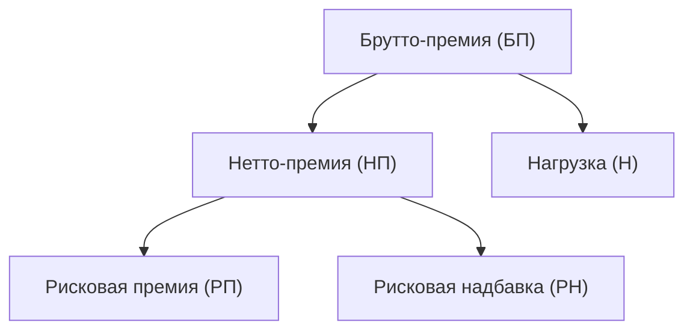
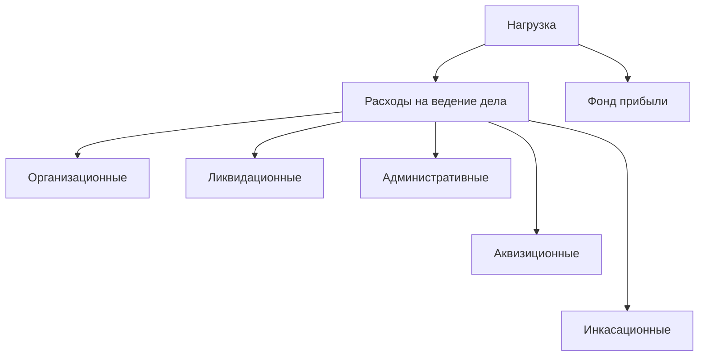

---
prev:
    text: Основы страхования и актуарных расчётов
    link: ../01/
next: false
---

# Основы страхования и актуарных расчётов

Лекция

::: tip План лекции
* Структура страховой премии
* Расчёт рисковой премии
* Методы расчёта рисковой надбавки
* Квантильный принцип расчёта рисковой надбавки
* Степень риска
* Периодические премии
* Использование функции полезности в актуарных расчётах
:::

## Структура страховой премии

### Основные понятия

**Страховая премия** (в страховании) или **брутто-премия** (gross premium; в актуарных расчётах) — это денежная сумма, которую страхователь обязан уплатить страховщику за страховую защиту объекта страхования от характерных рисков в соответствии с законом (*обязательное страхование*) или договором страхования (*добровольное страхование*).

**Страховая премия зависит от ряда факторов:**

* страховой стоимости ($C$) — чем дороже объект, тем выше будет премия;
* страховой суммы ($S$) — чем выше страховая сумма, тем больше премия;
* срока страхования — чем больше срок, тем выше премия;
* перечня рисков — чем больше рисков покрывает полис, тем он дороже;
* и др.

Страховая премия выплачивается *при вступлении* в страховые отношения *единоразовой* суммой или *частями* в течение *некоторого* или *всего* срока страхования.

**Суммарный объём страховых премий**, рассчитанный по всем функционирующим страховщикам — один из важнейших показателей страхового рынка. Он отражает:

* *проникновение страхования в экономику:* в развитых странах его доля от ВВП может достигать 12%, в развивающихся — 3%. Рост этого значения говорит о зрелости экономики и финансовой грамотности населения;
* *спрос на страховую защиту:* рост совокупных премий говорит о доверии к институту страхования и о том, что люди и компании чувствуют необходимость в финансовой защите;
* *общее экономическое состояние:* в период экономического роста увеличиваются доходы населения и компаний, покупается больше имущества, что ведёт к росту спроса на страхование;
* *потенциал для инвестиций в национальную экономику:* страховые компании инвестируют собранные премии в экономику для будущих выплат. Чем больше объём премий, тем больше "длинных" денег появляется в экономике, что способствует её стабильности и росту;
* *показатель финансовой устойчивости системы:* большой и растущий объём премий означает, что у страховщиков достаточно средств для формирования резервов. Это гарантирует выполнение ими своих обязательств.

**Страховой тариф (тарифная ставка, брутто-ставка)** — ставка страховой премии с единицы страховой суммы с учётом объекта страхования и характера страхового риска. Брутто-ставка обычно исчисляется в процентах от страховой суммы. Расчёт страховых тарифов — важнейшая задача актуарных расчётов, т. к. определяет финансовую устойчивость и конкурентоспособность страховщика.

**Страховой взнос (страховой платёж)** — единовременно перечисляемая часть страховой премии.

Если вся сумма страховой премии выплачивается за раз, то этот взнос называется **единовременной премией**. В этом случае понятия *страховой премии*, *страхового взноса* и *единовременной премии* идентичны.

Если страховая премия выплачивается частями, то этот взнос называется **периодической премией**. В этом случае *страховая премия* будет равна сумме *страховых взносов* (*периодических премий*).

В последнем случае цена договора будет выше в силу изменения стоимости денег и риска недополучения части платежей.

### Структура страховой премии

Брутто-премия представляет собой сумму **нетто-премии** (net premium) и **нагрузки**:

$$
\style{font-family:Times}{\text{
    Страховая премия = БП = НП + Н = РП + РН + Н
}}\!\!\!\!\!\!\!\!\!\!\!\!\!\!\!\!\!\!\!\!\!\!\!\!\!\!\!\!\!\!\!\!\!\!\!\!\!\!\!\!\!\!\!\!\!\!\!\!\!\!\!\!\!
$$

или, используя определение брутто-ставки (БС),

$$
\style{font-family:Times}{\text{БП = БС }}\!\!\!\!\!\!\!\!\! \cdot S,
$$

где $S$ — страховая сумма.

Такая структура страховой премии свойственна в основном для *добровольного страхования*.

### Структура страховой премии — ОСАГО

Страховые премии для всех *обязательных видов страхования* определяются законодательно и наряду с нетто-премией и нагрузкой часто содержат специальные резервы.

Например, страховая премия по ОСАГО на:
* 77% состоит из нетто-премии;
* 20% состоит из нагрузки;
* 2% состоит из резерва гарантий;
* 1% состоит из резерва текущих компенсационных выплат.

**Резерв гарантий** предназначен для финансирования компенсационных выплат пострадавшим, если страховщик виновника ДТП обанкротился либо у него отозвана лицензия.

**Резерв текущих компенсационных выплат** используется для выплат пострадавшим в ДТП, если виновник скрылся с места происшествия или у него отсутствует действующий полис ОСАГО (незастрахованная ответственность).

### Нетто-премия

**Нетто-премия** представляет собой рассчитанную актуариями цену последствий страхового риска и предназначена для возмещения убытков при наступлении страхового случая. Она является основной составляющей БП и определяется на основе вероятностных характеристик риска по данному виду страхования.

**Назначение НП:** формирование страховых резервов и финансирование платежей при наступлении страховых случаев.

Сумма всех НП образует **страховой денежный фонд**, который формирует страховые резервы, предназначенные для страховых выплат. Таким образом, НП остаётся в *групповой собственности страхователей*. Страховая компания не имеет права использовать эти средства по своему усмотрению, даже если убытки оказались меньше запланированных.

Структура НП существенно зависит от вида страхования. В страховании жизни НП рассчитывается исходя из таблиц смертности или функций дожития и нормы доходности. В страховании не-жизни НП имеет вид:

$$
\style{font-family:Times}{\text{НП = РП + РН }}\!\!\!\!\!\!\!\!\!\!\!\!\!\!
$$

### Рисковая премия

**Рисковая премия** (чистая премия, pure premium) — основная часть НП. Согласно <abbr title="закону больших чисел">ЗБЧ</abbr> вычисляется как математическое ожидание выплат страховщика в расчёте на один договор страхования и отражает основной принцип актуарных расчётов — **принцип эквивиалентности обязательств страховщика и страхователя**, который выражается в равенстве математических ожиданий двух величин: суммы всех страховых взносов и суммы всех страховых возмещений.

При увеличении объёма портфеля рисковая премия, приходящая на один договор, не изменяется: если мы имеем однородный портфель из независимых одинаково распределённых рисков с математическим ожиданием $\mathbb{E} Y_i = \mu$, то рисковая премия по одному договору:

$$
\style{font-family:Times}{\text{РП }}\!\!\! = \mathbb{E}Y_i = \mu,
$$

а совокупная РП, приходящаяся на один договор:

$$
{ \sum\limits_{i=1}^n \mathbb{E}Y_i \over n } = {\mu \cdot n \over n} = \mu.
$$

### Рисковая надбавка

**Рисковая надбавка** (loading) — часть НП, необходимая для обеспечения безубыточности страховых операций, если фактическая сумма выплат будет выше математического ожидания ущерба. Необходимость её формирования обусловлена тем, что на практике страховые портфели всегда ограничены по объёму и остаются зависимыми от случайности.

Чем выше риск, тем больший процент в НП составляет РП. Для расчёта РН, как правило, используются методы, связанные с характеристиками разброса предполагаемого ущерба — дисперсия и среднее квадратическое отклонение.

При увеличении объёма портфеля РН, приходящаяся на один договор, в отличие от РП, уменьшается. Этим объясняется тот факт, что крупные страховые компании могут предложить более низкие страховые тарифы.

### Нагрузка

**Нагрузка** — часть БП, поступающая в полное распоряжение страховщика и предназначенная для покрытия расходов на ведение дела и формирование прибыли. Как правило, нагрузка составляет фиксированный процент $f$ от БП:

$$
\style{font-family:Times}{\text{Н }}\!\!\! = f \cdot
\style{font-family:Times}{\text{БП }}\!\!\!,
$$

$$
\style{font-family:Times}{\text{БП }}\!\!\! = 
{ \style{font-family:Times}{\text{НП }}\!\!\! \over 1 - f}.
$$

**Компоненты нагрузки:**

* **Организационные расходы** — связаны с учреждением страховой компании. Это активы страховщика, которые он инвестирует в компанию.
* **Аквизиционные расходы** — производственные расходы, связанные с привлечением новых страхователей и заключением новых договоров (вознаграждение страховых агентов, изготовление и регистрация полисов, реклама и т. д.).
* **Инкасационные расходы** — расходы, связанные с обслуживанием налично-денежного оборота, поступающего от страхователей (сдача в банк денежных средств, изготовление квитанций и т. д.).
* **Ликвидационные расходы** — расходы на оплату труда лицам, занимающимся ликвидацией ущерба (оценка размера убытка, выяснение обстоятельств страхового случая, расходы на судебные разбирательства и т. д.).
* **Административные расходы** — расходы по управлению страховой компанией (оплата труда, аренда помещений, коммунальные платежи и т. д.).
* **Фонд прибыли** — выплата дивидендов акционерам, создание фонда предупредительных мероприятий с целью уменьшения риска.

## Расчёт рисковой премии

### Риски страхователя и страховщика

Основное правило расчёта РП — соблюдение принципа эквивалентности финансовых обязательств страховщика и страхователя:

$$
\style{font-family:Times}{\text{РП }}\!\!\! = \mathbb{E}Y.
$$

**Риск страхователя** заключается в том, что если страховой случай *не произойдёт*, то страховые взносы не будут ему возвращены.

**Риск страховщика** состоит в том, что если страховой случай *произойдёт*, то он обязан выплатить сумму, значительно превышающую сумму страхового взноса.

### Случай фиксированного ущерба