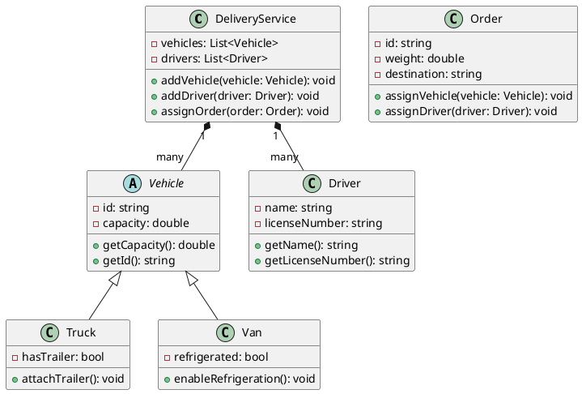

---
prev:
    link: ../03
    text: 3. Множественное наследование и агрегирование
next:
    link: ../05
    text: 5. Сериализация
---

**Лабораторная работа 4**

# UML-диаграммы

## Задание

Для набора классов из задания 2 лабораторной работы 3 (<u>последней актуальной версии!</u>):

1. Привести описание классов и отношений (как в примере ниже)
2. Дать текстовое описание UML-диаграммы классов в стиле PlantUML: https://plantuml.com/ru/ (как в примере ниже)
3. Привести графическое изображение диаграммы (можно использовать тот же сайт или другой графический инструмент)

### Пример

Задание 2 из лабораторной работы 3:

> «Создайте модель системы управления доставкой, с водителями, транспортом и заказами. Классы: DeliveryService, Vehicle, Driver, Order. Отношения: DeliveryService содержит список Vehicle и Driver (композиция). Order связан с Vehicle и Driver (агрегация). Vehicle наследован классами Truck и Van».

1. Привести описание классов и отношений
2. Дать текстовое описание UML-диаграммы классов в стиле PlantUML: https://plantuml.com/ru/
3. Привести графическое изображение диаграммы (можно использовать тот же сайт или другой графический инструмент)

#### 1. Классы и отношения

1. DeliveryService
   * Поля:
     * vehicles: List&lt;Vehicle&gt;
     * drivers: List&lt;Driver&gt;
   * Методы:
     * addVehicle(vehicle: Vehicle): void
     * addDriver(driver: Driver): void
     * assignOrder(order: Order): void
   * Отношения:
     * Композиция с Vehicle (содержит список транспорта, ответственность за их существование у службы).
     * Композиция с Driver (содержит список водителей, ответственность за их существование у службы).

2. Vehicle (абстрактный класс)
   * Поля:
     * id: string
     * capacity: double
   * Методы:
     * getCapacity(): double
     * getId(): string
   * Отношения:
     * Наследование с классами Truck и Van.

3. Truck (наследует от Vehicle)
   * Поля:
     * hasTrailer: bool
   * Методы:
     * attachTrailer(): void

4. Van (наследует от Vehicle)
   * Поля:
     * refrigerated: bool
   * Методы:
     * enableRefrigeration(): void

5. Driver
   * Поля:
     * name: string
     * licenseNumber: string
   * Методы:
     * getName(): string
     * getLicenseNumber(): string
   * Отношения:
     * Аггрегация с Order (водитель может существовать отдельно от заказа).

6. Order
   * Поля:
     * id: string
     * weight: double
     * destination: string
   * Методы:
     * assignVehicle(vehicle: Vehicle): void
     * assignDriver(driver: Driver): void
   * Отношения:
     * Аггрегация с Vehicle (транспорт назначается на время выполнения заказа).
     * Аггрегация с Driver (водитель назначается на время выполнения заказа).

#### 2. Текстовая диаграмма в стиле PlantUML

#### 3. Диаграмма

